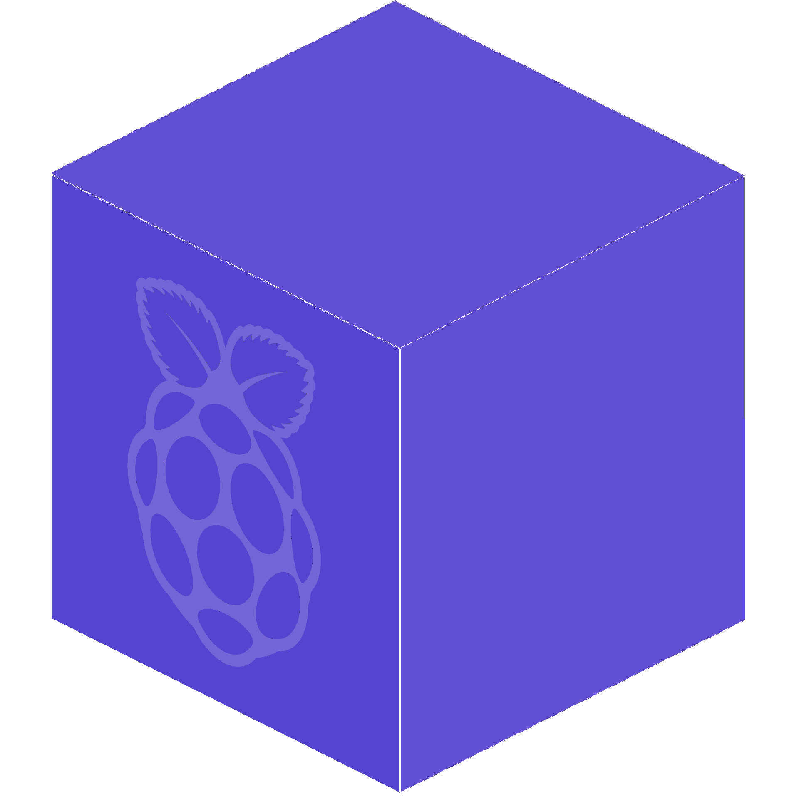

# raslib
[](https://github.com/antoninhrlt/raslib/graphs/commit-activity)
[](https://github.com/antoninhrlt/raslib/blob/master/LICENSE.txt)
[](https://twitter.com/messages/compose?recipient_id=1171783417828130816&text=(raslib)%20Hello%20Antonin%20!%20I%20would%20like%20...)


C++ oriented-object library for Raspberry Pi

<p align="center">
     
</p>
A day, I wanted to use C++ with my Raspberry PI 4B, and I don't 
have find any library who is written in C++ oriented-object that I liked. Like 
say the proverb : "be the change you want to see" (Gandhi). So I wrote this 
library. Enjoy ! [Website](https://antoninhrlt.github.io/raslib)
Although raslib is open source (license MIT), if you make a project from this
library, i would like to you keep my names on raslib's files, especially for the
project be a litlle more known.


## Elements of the library :
 - GPIO controller
 - Motor controller (Written thanks to the GPIO controller, it's only a class 
 allowing to reduce the working time. Make for L298N controller)
 - Socket generator (Only the server.. to you to create the client on an Android
  app for example. Find [here](https://github.com/antoninhrlt/rasdroid) my 
  Android application to remotely control my Raspberry PI robot)

## Links :
 - [Install](#Install)
 - [Blink a led](#blink-a-led)
 - [L298N Motor](#l298n-motor)
 - [Complete example](#complete-example)

## Install
Get raslib: `git clone https://github.com/antoninhrlt/raslib.git`\
Install: `make install`\
Done !

### How to build your project 
Add compilation flag: `-lraslib`\
Example: `g++ <files.cpp> -o output -lraslib`

## Blink a led
This is only an example, let's place to creativity !
```cpp
#include <raslib/raslib.hpp>
#include <raslib/pin/gpio.hpp>
#include <raslib/uti/utils.hpp>

void blink(Ras::Gpio *led)
{
    while (true)
    {
        led->write(Ras::HIGH);
        Ras::sleep(1000); // 1 second

        led->write(Ras::LOW);
        Ras::sleep(1000);
    }
}

int main(int argc, char **argv)
{
    Ras::Gpio led_21 {21};
    blink(&led_21);

    return 0;
}
```

## L298N Motor
```cpp
#include <raslib/raslib.hpp>
#include <raslib/uti/utils.hpp>
#include <raslib/pin/l298n.hpp>

int main(int argc, char **argv)
{
    Ras::L298n motor_l {14, 18, 15};
    Ras::L298n motor_r {};

    motor_r.define(25, 8, 7);

    while (true)
    {
        motor_l.write(Ras::FORWARD);
        motor_r.write(Ras::FORWARD);
        Ras::sleep(5000); // 5 seconds

        motor_l.write(Ras::STOP);
        motor_r.write(Ras::STOP);
        Ras::sleep(5000);
    }

    return 0;
}
```
Your connections :
*from https://alcalyn.github.io/assets/images/rpi-motors/rasp-l298n.png*


## Complete Example
```cpp
#include <raslib/raslib.hpp>
#include <raslib/uti/utils.hpp>
#include <raslib/tcp/server.hpp>
#include <raslib/pin/gpio.hpp>

#include <thread>
#include <iostream>

void server()
{
    // CHOOSE YOUR OWN IP
    Ras::Server server {"192.168.1.55", 9999};
    server.screate(ras::AUTO);

    while (true)
    {
        server.saccept();
        int signal {-1};

        while (signal != 0) // signal sent when connection is closed
        {
            signal = server.sget();
            std::cout << "Received : " << signal << std::endl;
        }
        server.shut();
    }
}

void blink(Ras::Gpio *led)
{
    while (true)
    {
        led->write(Ras::HIGH);
        Ras::sleep(1000); // 1 second

        led->write(Ras::LOW);
        Ras::sleep(1000);
    }
}

int main(int argc, char **argv)
{
    std::thread server_th {server};

    Ras::Gpio led_21 {21};
    std::thread blink_th {blink, &led_21};

    server_th.join();
    blink_th.join();

    return 0;
}
```
